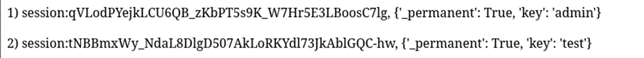
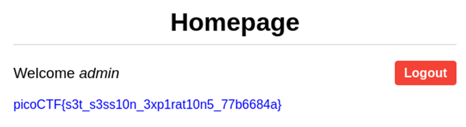

## Description:
Proper session timeout controls are critical for securing user accounts. If a user logs in on a public or shared computer but doesn’t explicitly log out (instead simply closing the browser tab), and session expiration dates are misconfigured, the session may remain active indefinitely. This then allows an attacker using the same browser later to access the user’s account without needing credentials, exploiting the fact that sessions never expire and remain authenticated. Your friend tells you to check out a new social media platform he built a few years ago. Although its still under development, he said the site is almost complete. He also mentioned that he hates constantly logging into sites, and so has made his page that 'once you login, you never have to log-out again'!

## Solution:
1. After creating an account and logging in, I saw a tweet about an interesting page at `/sessions`. Here, I found two cookies: one for admin and one for the current user.  

2. Using the web browser developer tools, I created a new cookie with the given value for admin and accessed the homepage again, which contained the flag.  

## Flag:
picoCTF{s3t_s3ss10n_3xp1rat10n5_77b6684a}