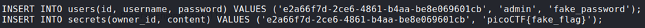
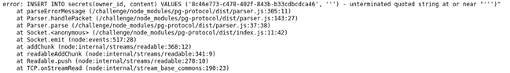
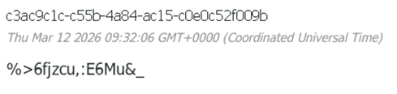
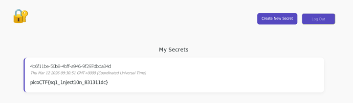

## Description:
This secret box is designed to conceal your secrets. It's perfectly secure—only you can see what's inside. Or can you? Try uncovering the admin's secret.

## Solution:
1. I looked at the database file in the given source code and found that the flag is in the `secrets` table with the admin’s user ID, which means I cannot view it. <br>
 <br><br>
2. However, I found that the "create secret" functionality is vulnerable to SQLi. It also displays the error message when there is any syntax error. For example, when I entered a single quote: <br>
 <br><br>
3. I can exploit this vulnerability to retrieve the flag from the `secrets` table. 
4. However, since the original query is an `INSERT` statement rather than the usual `SELECT` statement, I had to be creative with the payload. I couldn’t concatenate the two SQL queries using a simple `UNION`. Instead, I had to insert an extra record in addition to the original one with my own user ID (which I got from the error message) and the content would be my actual payload. <br>
Here is the payload I used:
```
'), ('8c46e773-c478-402f-843b-b33cdbcdca46', (SELECT content FROM secrets WHERE owner_id = 'e2a66f7d-2ce6-4861-b4aa-be8e069601cb'))--
```
5. Alternatively, since I also know that the admin’s password is stored in the users table, I could also retrieve the admin’s password and use it to log in as the admin. <br>
Here is the payload to get the admin’s password:
```
'), ('901d5609-2448-47cc-bbb3-d758314aa5fd', (SELECT password FROM users WHERE username = 'admin'))—
```

 <br>
 <br>

## Flag:
picoCTF{sq1_1nject10n_831311dc}