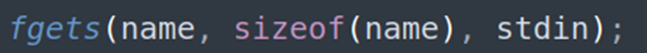

## Description:
A friendly program wants to greet you… but its goodbye might say more than it should. Can you convince it to reveal the flag?

## Solution:
1. We are given a program to connect to, the source code, and executable file. First, let’s look at the source code. It appears that this program takes in user input, then outputs the input and another string. An interesting part of the program is the line that takes in user input. There is no limit on the length of input, and the program just accepts everything the user enters.

2. And when we look at the function in charge of the output, we see that we have 2 variables – one for the user’s input and another for a command to be executed. If we can change the command, we would be able to interact with the server.
3. From the declaration of the arrays, we can tell that each can hold 10 characters. We can double confirm this in ghidra. This means that if we fill up the allocated 10 characters, we can then set the command to be anything we wanted. 
4. Connect to the program and send 10 a’s followed by pwd. We find that it worked as expected. Continue to add 10 a’s (or any character) before the desired command to find the flag. 

## Flag:
picoCTF{0v3rfl0w_c0mm4nd_0e1de30d}