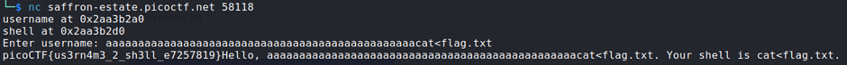

## Description:
This program greets you and then runs a command. But can you take control of what command it executes?

## Solution:
1. Similar to Input Injection 1, we are given a program with a buffer overflow vulnerability. This time, the program very helpfully gives us the addresses of the two variables. 
2. We can calculate the difference to be 0x30, which means that we need to add 0x30 characters at the beginning of our input. Upon looking at the source code, it seems that we again need to modify the command being executed.
3. Using the same strategy as before (but using 0x30 characters rather than 10 characters), we find a text file which most probably contains our flag. 
4. However, this program uses `scanf` which considers whitespace as a delimiter when using the `%s` format specifier. So our command must not have any whitespaces. To output the content of the file, use cat&lt;flag.txt. With that, we get our flag.

## Flag:

picoCTF{us3rn4m3_2_sh3ll_e7257819}
