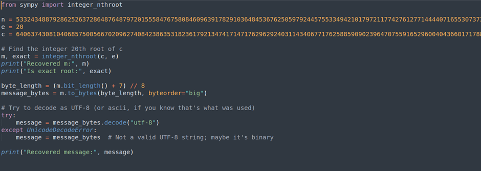

## Description:
We received an encrypted message. The modulus is built from primes large enough that factoring them isn’t an option, at least not today. See if you can make sense of the numbers and reveal the flag.

## Solution:
1. We are given n, e and c. We need to calculate m (plaintext). Given that e is relatively small, we can use the Coppersmith Attack to calculate m. Use this python script to calculate m and convert the integer into text:

## Flag:
picoCTF{t1ny_e_f053d79c}