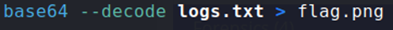

## Description:
The SOC team discovered a suspiciously large log file after a recent breach. When they opened it, they found an enormous block of encoded text instead of typical logs. Could there be something hidden within? Your mission is to inspect the resulting file and reveal the real purpose of it. The team is relying on your skills to uncover any concealed information within this unusual log. Download the encoded data here: Logs Data. Be prepared—the file is large, and examining it thoroughly is crucial.

## Solution:
1. We are given a text file with a long base64 string. Decode the string and convert the output into an image file. 

2. Open the image file. We see some text in it. Use CyberChef to decode the text (from Hex), and we get the flag.

## Flag:
picoCTF{forensics_analysis_is_amazing_24d16895}