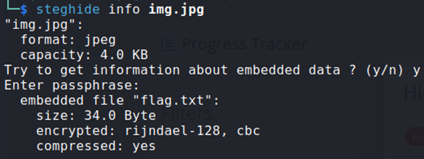
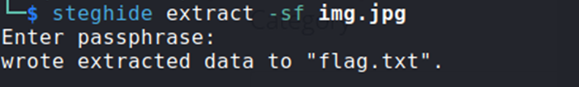

## Description:
You’re given a seemingly ordinary JPG image. Something is tucked away out of sight inside the file. Your task is to discover the hidden payload and extract the flag.

## Solution:
1. We are given an image. First, use the file command to view some brief information about the metadata. We see a comment with a cryptic string. 
2. Use CyberChef to decode this string, and we see that decoding from base64 gives “steghide:” followed by another base64-encoded string. 
3. Decode this string, which would be the passphrase when using steghide on the image file. 
4. First, use steghide to view more info about the image. We see an embedded file named “flag.txt”. 
5. Next, extract this embedded file. View the contents of the file, and we get the flag.

## Flag:
picoCTF{h1dd3n_1n_1m4g3_871ba555}