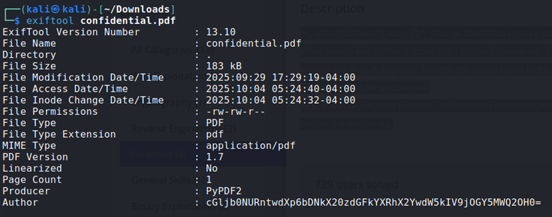

## Description:
Hi, intrepid investigator! 📄🔍 You've stumbled upon a peculiar PDF filled with what seems like nothing more than garbled nonsense. But beware! Not everything is as it appears. Amidst the chaos lies a hidden treasure—an elusive flag waiting to be uncovered. Find the PDF file here Hidden Confidential Document and uncover the flag within the metadata.

## Solution:
1. We are given a pdf file, and we need to find a flag in the metadata. First, let’s see what’s in this file. We see some text and some obscured text. Nothing helpful.   
2. The challenge description mentioned that the flag is in the metadata, so let’s try `exiftool` next.
3. The author was an interesting string, which seemed to be encoded in base64. Use CyberChef to decode the string, and we get the flag!

## Flag:
picoCTF{puzzl3d_m3tadata_f0und!_c8f91d68}