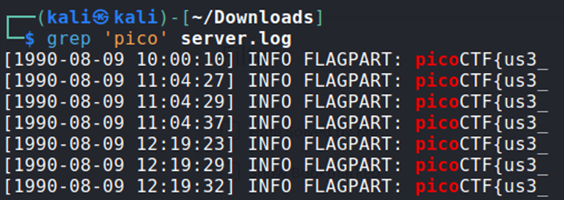
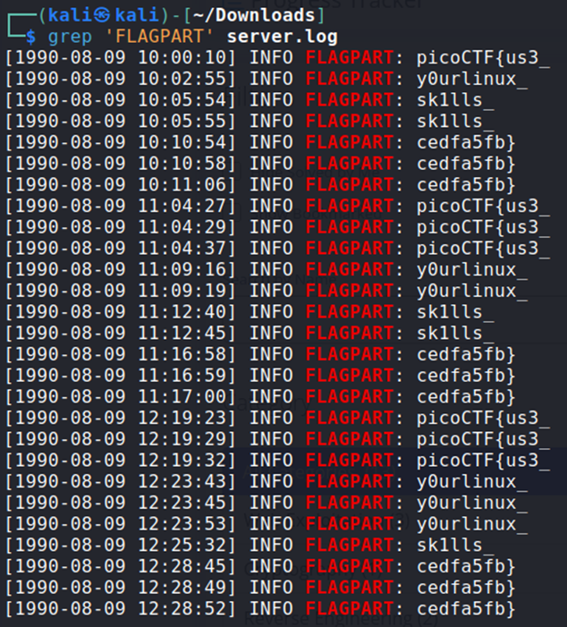

## Description:
Our server seems to be leaking pieces of a secret flag in its logs. The parts are scattered and sometimes repeated. Can you reconstruct the original flag? Download the logs and figure out the full flag from the fragments.

## Solution:
1. We are given a log file with many rows of text. First, use grep to search for "pico", which would be part of the flag.

2. We get the first part of the flag. If we look at the output carefully, it seems that the lines with "INFO FLAGPART" are fragments of our flag. So use grep to search for FLAGPART, and we get all the parts of the flag.

## Flag:
picoCTF{us3_y0urlinux_sk1lls_cedfa5fb}