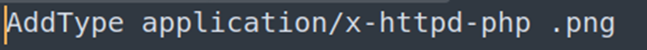

## Description:
A university's online registration portal asks students to upload their ID cards for verification. The developer put some filters in place to ensure only image files are uploaded but are they enough? Take a look at how the upload is implemented. Maybe there's a way to slip past the checks and interact with the server in ways you shouldn't. You can access the web application at here!

## Solution:
1. We are given a website with a vulnerable upload function. The goal is to upload a php script that allows us to execute commands on the server. So I wrote the following php script:
```php
<?php
    echo shell_exec($_GET['cmd']);
?>
```
*(It’s also possible to directly state the command to be executed in the php file, but that would mean having to reupload the script every time we wanted to execute a different command. So for convenience, I decided to pass the command as a parameter in the URL.)*
2. When we try uploading the php script, we find that it’s prohibited by the website since it only allows image files. We can bypass this restriction by changing the file extension to .png or .jpg. This successfully allows us to upload our script. 
3. But now we have another problem: since our file has an image extension, the server does not recognise it as php and will not execute it. So, we create another file named .htaccess with the following content. This is a configuration file that control the behaviour of Apache servers at the directory level. We can use it to tell the server to treat image files as php files. 

*(Note: I converted my php script to a png file, which is why I used .png here.)*
4. Upload .htaccess to the website (if your file browser hides hidden files, press Ctrl + H to show hidden files). Then, try to execute our script again, and we see an error stating that an argument is missing. This means that our script is successfully being executed by the shell! Now, we can explore and find the flag by passing the desired command as a parameter in the URL.
5. We cannot `cd`, so use absolute paths and ls to explore the other directories without navigating to them. 

## Flag:
picoCTF{s3rv3r_byp4ss_20193d1e}