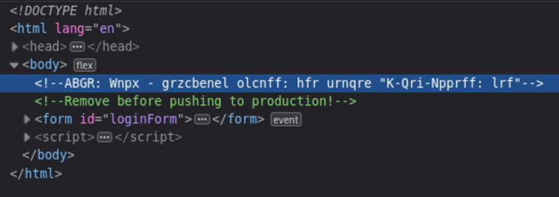
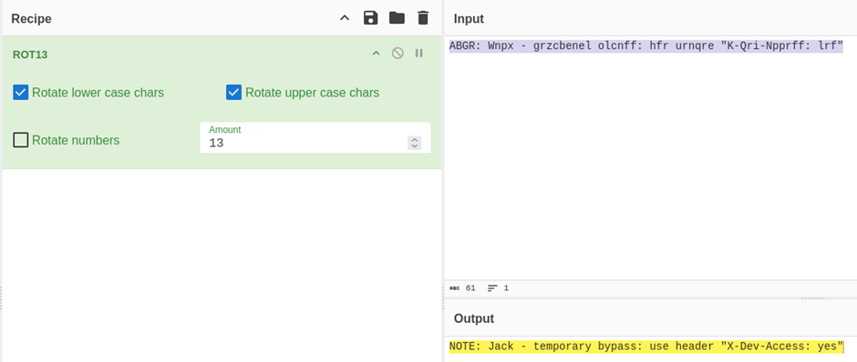

## Description:
We’re in the middle of an investigation. One of our persons of interest, ctf player, is believed to be hiding sensitive data inside a restricted web portal. We’ve uncovered the email address he uses to log in: ctf-player@picoctf.org. Unfortunately, we don’t know the password, and the usual guessing techniques haven’t worked. But something feels off... it’s almost like the developer left a secret way in. Can you figure it out? The website is running here. Can you try to log in?

## Solution:
1. We are given a login page and the email used to login, but not the password. The challenge description mentioned the developer leaving a secret way in, so let’s inspect the page first. 
2. We see an interesting gibberish comment, and a reminder to remove it before pushing to production. 

3. This mysterious string must be the secret we need. Using cyberchef’s magic function to try to decode this message, we don’t get any result. One of the clues provided mentioned rotating each letter by 13, which means ROT13. Use the ROT13 function in cyberchef, and we get a message to use the HTTP header X-Dev-Access to bypass the authentication. 

4. Use BurpSuite to modify the request and add the required header. Then, we get the flag!

## Flag:
picoCTF{brut4_f0rc4_125f752d}