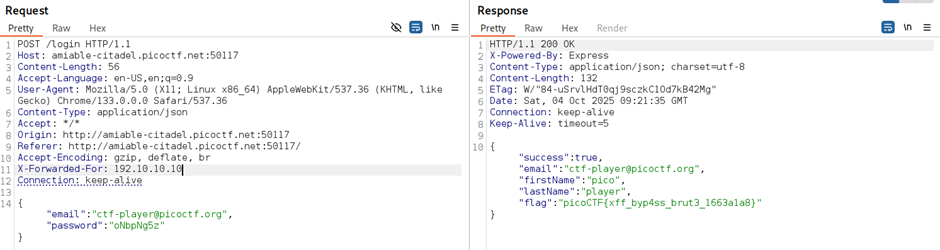

## Description:
The login system has been upgraded with a basic rate-limiting mechanism that locks out repeated failed attempts from the same source. We’ve received a tip that the system might still trust user-controlled headers. Your objective is to bypass the rate-limiting restriction and log in using the known email address: ctf-player@picoctf.org and uncover the hidden secret. The website is running here. Can you try to log in?. Download the passwords list here.

## Solution:
1. Similar to the previous version of this challenge, we are given a login page. This time, there aren’t any helpful comments in the code, but the challenge description mentioned user-controlled headers. This implies that we again have to use BurpSuite to modify the request headers.  
2. The website locks out failed attempts from the same source, but what if we can appear to be from a different source each time? The X-Forwarded-For header can be used to provide the source IP. 
3. So, we need to use BurpSuite to add this header, and use an arbitrary IP address as the source. Use trial and error and the password list provided. Every time we fail, change the IP address (we can just increment by 1), and try the next password.  

## Flag:
picoCTF{xff_byp4ss_brut3_1663a1a8}