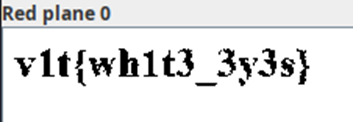

## Description:
This image is blank is it ?

## Solution:
1. We are given an image which is just a plain white background. 
2. Open the file in `stegsolve` and inspect the individual bit planes. The flag is visible in red plane 0.

## Flag:
v1t{wh1t3_3y3s}