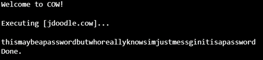
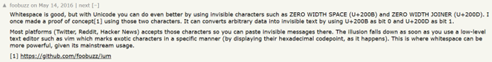
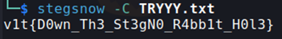

## Description:
I really like **Cows **

## Solution:
1. We are given a JPEG file. Use `exiftool` to view its metadata, where we see a long comment filled with "Moo". This is an eccentric programming language (like Rockstar), where programs are written solely using Moo. Use an online compiler, and we get a password.

2. This hints that we may need to use `steghide` to discover and extract embedded files. Using `steghide`, we are able to extract a zip archive. 
3. Extract the contents, and we get two txt files (`extract.txt` and `TRYYY.txt`). Using `cat` shows that both files have the same text: TRY HARDERRR, but `TRYYY.txt` has a lot of whitespace at the end. 
4. The large amount of whitespace definitely has some purpose/meaning, especially when we have another file with the exact same content but without the extra whitespace. I found something called whitespace steganography, which conceals text using spaces and tabs.

5. And I found a tool that can reveal such messages, `stegsnow`. Use it to extract the hidden message, which is the flag.

## Flag:
v1t{D0wn_Th3_St3gN0_R4bb1t_H0l3}