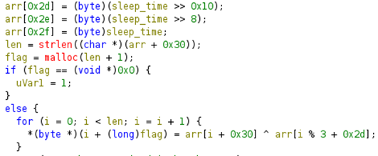
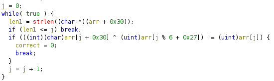

## Description:
Enter your flag and the snail will deliver it to headquarters for verification. But be careful - it moves slowly!

## Solution:
1. Open the exe in `Ghidra`. Based on the decompiled source code, the user’s input is stored in an array, index `0x30` (I shall refer to this as `arr[0x30]` henceforth). Then, it prints a text-based snail animation which pauses for increasing lengths of time. Then, the flag is calculated by XORing each character of the user input with one of: `arr[0x2d]` to `arr[0x2f]`. 

2. Next, the program populates the rest of `arr`, up to `0x2c`. Then, it checks whether the input entered is correct by comparing the result of `arr[j+0x30] XOR arr[j%6 + 0x27]` and the value stored in `arr[j]`. All values must be equal for the input to be considered correct.

3. Now we know how to get the flag, and how our input is checked. And we should remember that our input is stored in the array starting from index `0x30`, i.e. `arr[i+0x30]`. So,
```flag = arr[i+0x30] ^ arr[i%3 + 0x2d]
flag = input ^ arr[i%3 + 0x2d]
input ^ arr[i%6 + 0x27] = arr[i]
input = arr[i] ^ arr[i%6 + 0x270]
flag = arr[i] ^ arr[i%6 + 0x270] ^ arr[i%3 + 0x2d]```


## Flag:
v1t{sn4il_d3l1v3ry_sl0w_4f_36420762ab}