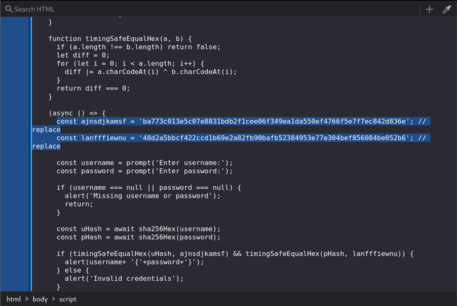

## Description:
Login

## Solution:
1. We are prompted for a username and password. Then, the website performs some sort of checks and outputs "invalid credentials" if the username and password are incorrect. 
2. View the source code, and we see the JS functions used to validate the credentials entered. In the JS, we are given two SHA256 hashes, one for the username and one for the password. 

3. Use an online tool to get the plaintext, which form the flag. 

## Flag:
v1t{p4ssw0rd}