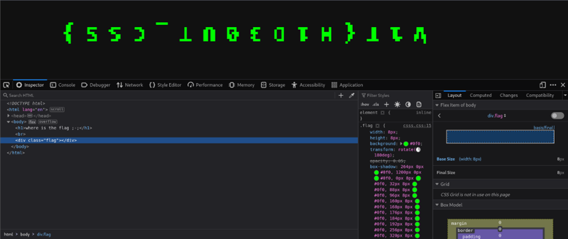

## Description:
Are you a front end dev ?

## Solution:
1. We are given a plain website with the text "where is the flag". The name of this challenge implies Cascade **Style** Sheet (CSS), and the description mentions being a front end dev; so let’s check the source code. 
2. We see a div with the class "flag" that is set to hidden. Remove the hidden attribute, and we see some faint text appearing in the background. 
3. In the styles applied to this div, we can see that opacity has been set to 0.05. Disable this selection, and the flag appears. 
4. But the h1 text is still blocking the flag, so add a new style to the heading, setting opacity to 0. Now, we can see the flag clearly (it’s upside down).

## Flag:
v1t{H1D30UT_CSS}