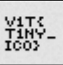

## Description:
Do you see the tiny flag :>

## Solution:
1.The website is very simple, but decorative (faint little dots follow our cursor). Anyway, the flag is supposed to be very “tiny”. Something tiny in a website would be the favicon. 
2. View the source code, open the favicon and there’s our flag. Tiny indeed!  

## Flag:

V1T{T1NY_ICO}
