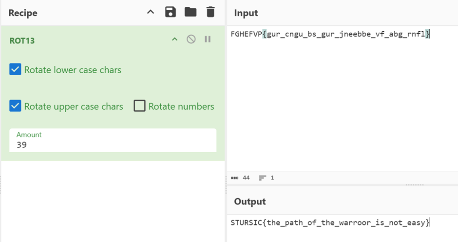

## Description:
An ancient scroll was found with this text. The key to decrypt lies in the number XIII: Navigate the link : https://czy21.test1.ip-167-235-30-42.swiftwave.xyz/

## Solution:
1. The challenge description mentioned the number 13, which suggests ROT13. 
2. Navigate to the link to get the encrypted string, and use CyberChef to decrypt it. 

3. The original decrypted string is: STURSIC{the_path_of_the_warroor_is_not_easy}. We can clearly see two typos (STURSEC and warrior). Correct the two typos to get the correct flag.

## Flag:
STURSEC{the_path_of_the_warrior_is_not_easy}