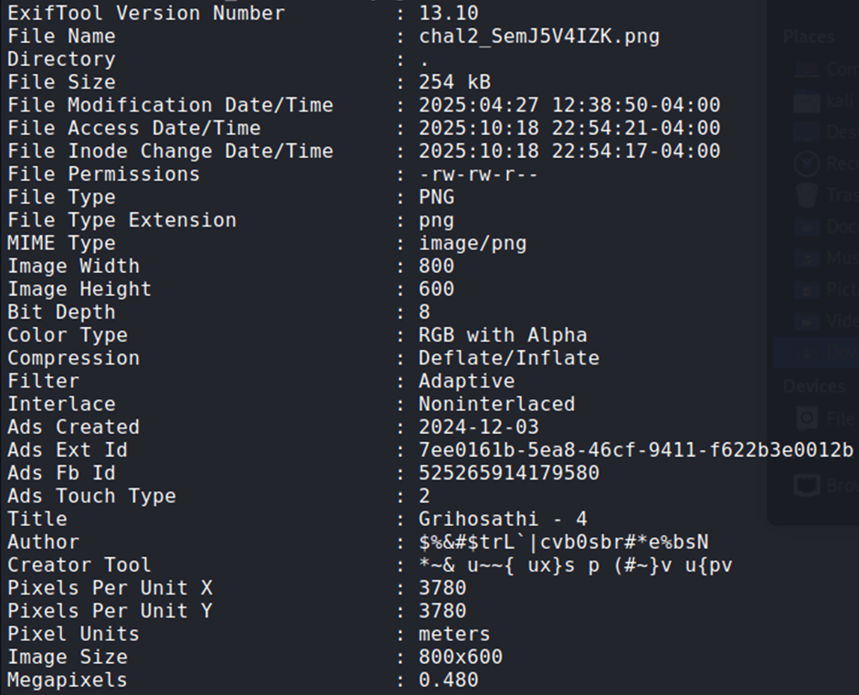

## Description:
Find the Flag from the image

## Solution:
1. We are given a png file, which says "Hey you find me". Since this is a forensics challenge, use `exiftool` to view the image’s metadata. We see an interesting string in the author section.

2. Use CyberChef to decode it (ROT47), and we get the flag.

## Flag:
STURSEC{1M4G3_D3CRY6T3D}