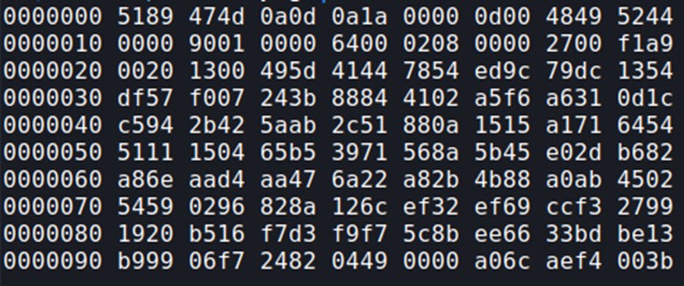

## Description:
This is a disaster solve it

## Solution:
1. We are given a png file. When I run `file` to identify the file type, it says "data". This is strange since the file is obviously an image, which hints that the file’s magic number may be corrupted. 
2. Search online for the magic number of a png file, and use `hexeditor` to fix the corrupted bytes. 
3. Open the fixed image file to get the flag.

## Flag:
CYBERARENA{fix_the_header_to_see_me}