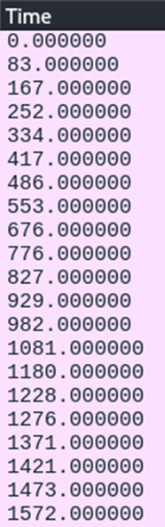

## Description:
Control Message Protocol

## Solution:
1. We are given a pcap file with multiple ICMP packets. There isn’t any interesting information in the packets themselves, since they are all identical. The only thing different is the time, which are decimal integers.
2. I tried converting the first few integers to ASCII, but only the first non-zero integer (83) could be converted; the rest were out of range.
3. Interestingly, 83 becomes S, which is the correct format for our flag; so I tried taking the difference between two consecutive integers (83-0=83, 167-83=84, ...) and converting that to ASCII. With that, I got the flag.

## Flag:
STURSEC{d3f5cc00_24cf_7fce_92c0_0c0c22f0afd5} 