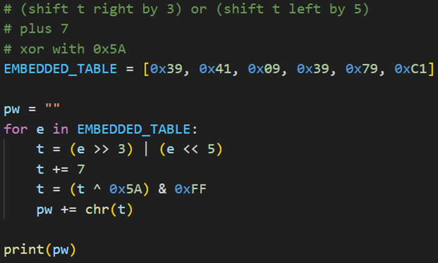

## Description:
Welcome to the another challenge of reverse series your task is to find the correct passphrase

## Solution:
1. We are given a Python script, and we are asked to find the correct passphrase, which is part of the flag. 
2. First, there are a lot of unused literal strings (""" """) in the code, which make it less readable. Delete all these strings, and we see that our code is actually quite short. 
3. To get the passphrase, we essentially have to reverse the function `transform_byte` so that our output becomes the same as the values in `EMBEDDED_TABLE`.
4. I used a simple for loop to reverse the function and get the required input.

## Flag:
STURSEC{phantom_init_turtle}