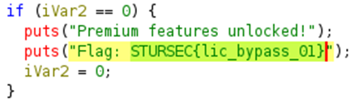

## Description:
This is a practice challenge of the reverse engineering challenges lats start the reverse engineering series from here

## Solution:
1. We are given a program and asked to reverse engineer it to find the flag. First, run the program to see how it works.  
2. We are told that we need to pass one argument (the license). I tried passing an arbitrary file, but it rejected my license, showing that it performs some sort of check.  
3. Let’s look at the source code using Ghidra. I was trying to understand what was happening in the main function when I suddenly saw that the flag was actually right there in the source code! Just copy and paste it into the CTF platform, and we’re done.

## Flag:
STURSEC{lic_bypass_01}