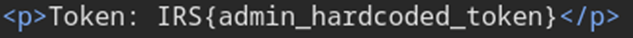
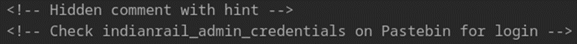
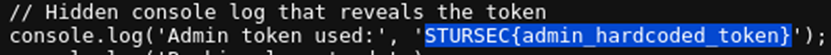

## Description:
In this Railway Scenario the Information's are hard coded find it Flag Format: STURSEC{...}

## Solution:
1. We are told that all the information is hard coded, which may mean that we can find useful information in the website’s source code. Upon inspecting the page I found a token in the HTML.

2. It looks like a flag, but it has the wrong format (doesn’t begin with STURSEC). Moving on, I also see a comment with a “hint”.
 
3. I searched up Pastebin, which is a website where people can share text. I found the text stated in the hint, but didn’t find anything useful. 
4. Then while exploring the website, I realised that the feedback form’s submit button actually works. So, I decided to look at the JS code. 
5. And that’s when I saw the flag in one of the functions. Alternatively, it can be viewed in the console as well.
 
*(I genuinely have no idea why I was told to look in Pastebin, probably just a distraction XD)*

## Flag:
STURSEC{admin_hardcoded_token}